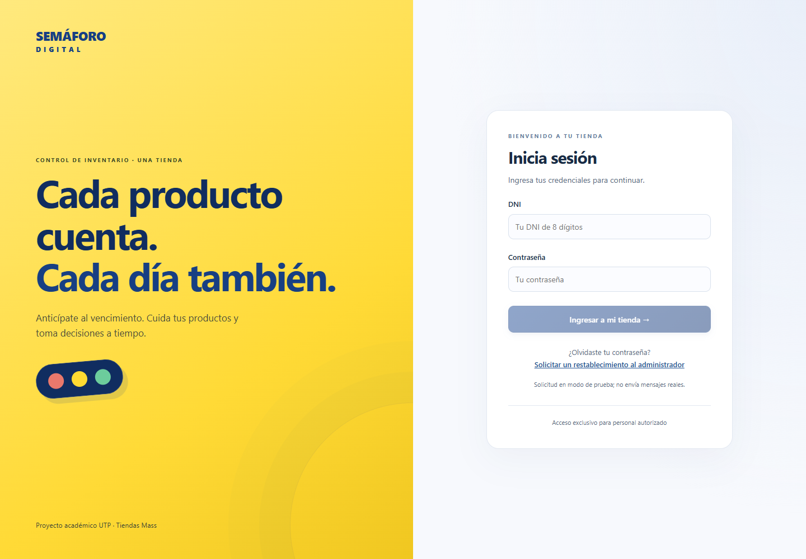

# Semáforo Digital Mass

Aplicación web educativa para gestionar el inventario y las fechas de vencimiento de una tienda. Permite registrar productos y lotes, priorizar su atención mediante un semáforo y llevar un historial de ventas, promociones y mermas.

Incluye acceso para **programador, supervisor y empleado**, con permisos según su función. Fue desarrollada como proyecto académico de la Universidad Tecnológica del Perú (UTP).

## Objetivos

- Digitalizar el registro de productos, lotes y fechas de vencimiento.
- Facilitar la identificación de lotes próximos a vencer mediante alertas e indicadores.
- Ayudar a prevenir mermas con una atención oportuna y trazable del inventario.
- Organizar las operaciones y responsabilidades del personal mediante roles.
- Ofrecer consultas de apoyo a través de un chatbot con información autorizada.

## Vista previa

Pantalla de acceso del proyecto:

[Abrir la aplicación local](http://localhost:4200/login), después de iniciarla con los pasos de abajo. El alojamiento público todavía está pendiente de configurar.

## Qué incluye

- **Banner y acceso:** presentación del proyecto e inicio de sesión con DNI y contraseña.
- **Resumen y alertas:** lotes clasificados en verde, amarillo, rojo y vencido; búsqueda y filtros de inventario.
- **Productos y categorías:** catálogo interno con SKU, EAN-13 opcional, unidades y plazos de aviso.
- **Lotes y promociones:** registro de ingresos, ventas, promociones y mermas con historial de operaciones.
- **Mi cuenta:** solicitudes de cambio de contraseña al programador y notificaciones de solicitudes pendientes.
- **Administración:** personal, reportes, auditoría, automatización y consulta de la base de datos en español.
- **Chatbot:** asistente de consulta con GPT y Streamlit, disponible según los permisos de cada rol.
- **Pie de página:** identificación del proyecto académico.

El alcance actual es una tienda. El buscador de tiendas y el folleto comercial no están implementados.

El programador administra cuentas y contraseñas. El supervisor registra y edita las operaciones permitidas; el empleado consulta y registra, sin editar ni eliminar. Los accesos se comprueban también en el servidor.

## Tecnologías usadas

| Área | Tecnologías |
| --- | --- |
| Interfaz | Angular 20, TypeScript, HTML, CSS, Bootstrap y PWA |
| Servidor | Java 21, Spring Boot, Spring Security, JPA y Flyway |
| Base de datos | MySQL 8.4, con tablas de negocio en español |
| Asistente | Python, Streamlit y API de OpenAI |
| Automatización y correo | n8n y Apache Commons Email |
| Ejecución | Docker Compose y Nginx; Node.js 24 para los scripts locales |
| Pruebas | Vitest, Analog, jsdom, Playwright, JUnit y Testcontainers |
| Integración y entrega | GitHub Actions y GitHub Container Registry |

## Cómo abrirla

### En Windows

1. Instala **Docker Desktop** con el motor Linux y **Node.js 24** si todavía no los tienes.
2. En este repositorio, selecciona **Code → Download ZIP** y extrae el archivo en una carpeta.
3. Abre Docker Desktop y espera a que su motor esté listo.
4. Dentro de la carpeta extraída, ejecuta **INICIAR_PROYECTO.bat**. El primer inicio descarga los servicios y prepara la base de datos; puede tardar varios minutos.
5. Cuando termine, se abrirá el navegador. También puedes entrar en [http://localhost:4200/login](http://localhost:4200/login).
6. Para detener los servicios y conservar los datos, ejecuta **DETENER_PROYECTO.bat**.

Esta aplicación utiliza un servidor y una base de datos: necesita iniciar sus servicios antes de abrirse en el navegador.

### Primer acceso y configuración

- El primer inicio genera un archivo privado **infra/.env**. En una base vacía, **BOOTSTRAP_DNI** y **BOOTSTRAP_PASSWORD** crean la cuenta inicial del programador.
- Consulta esas dos variables para entrar. El programador cambia su clave inicial y crea las cuentas del personal desde su panel.
- Panel del programador: [http://localhost:4200/administracion](http://localhost:4200/administracion).
- Panel de empleado y supervisor: [http://localhost:4200/](http://localhost:4200/), con la cuenta y los permisos correspondientes.
- Para habilitar GPT, coloca **OPENAI_API_KEY** en **infra/.env** y vuelve a iniciar el proyecto para aplicar la configuración. La API requiere una clave válida y cuota disponible.
- El correo requiere configurar las variables **SMTP_***. La recuperación por correo está reservada al programador; el personal solicita el cambio desde **Mi cuenta**.
- MySQL está disponible en **127.0.0.1:3307**, base **semaforo**. Sus credenciales se consultan en **infra/.env**.

El repositorio incluye **infra/.env.example** como referencia. Las contraseñas, claves, datos reales y respaldos permanecen fuera de GitHub. El enlace de solicitud del login conserva una demostración; las solicitudes del personal autenticado se guardan en la base de datos.

## Estructura de archivos

| Archivo o carpeta | Contenido |
| --- | --- |
| **README.md** | Presentación del proyecto e instrucciones de uso. |
| **INICIAR_PROYECTO.bat / DETENER_PROYECTO.bat** | Inicio y parada de los servicios en Windows. |
| **src/** | Interfaz Angular, estilos, rutas, pantallas y pruebas unitarias. |
| **public/** | Iconos y manifiesto de la aplicación web progresiva. |
| **backend/** | API Java, autenticación, reglas del inventario y pruebas del servidor. |
| **backend/src/main/resources/db/migration/** | Migraciones que crean y actualizan la estructura de MySQL. |
| **chatbot/** | Asistente Streamlit y sus dependencias de Python. |
| **n8n/** | Flujos de consulta y eventos críticos, sin credenciales reales. |
| **infra/** | Docker Compose, imágenes, Nginx y ejemplo de configuración. |
| **base_de_datos/exportar.mjs** | Generación de una copia privada de consulta de la base de datos. |
| **scripts/** | Preparación local, respaldos, verificaciones de seguridad y despliegue. |
| **e2e/** | Pruebas de recorridos completos de la aplicación. |
| **docs/** | Vista previa y documentación de solicitudes, chatbot y CI/CD. |
| **.github/workflows/** | Automatizaciones de pruebas, publicación de imágenes y despliegue. |
| **package.json / package-lock.json** | Comandos y dependencias de Node.js con versiones resueltas. |
| **angular.json / tsconfig*.json** | Configuración de Angular y TypeScript. |
| **vite.config.ts / playwright.config.ts** | Configuración de las pruebas unitarias y de navegador. |
| **ngsw-config.json / proxy.conf.json** | Caché de recursos estáticos de la PWA y conexión local con la API. |
| **.gitignore / .dockerignore / .gitattributes** | Exclusiones de archivos privados y generados, y formato de archivos. |

Para ejecutar las pruebas: **npm test**. Para Chromium: **npx playwright install chromium** y **npm run test:browser**. Desde **backend/**, ejecuta **mvnw.cmd test** para las pruebas Java, con Docker abierto.

Los cambios se preparan en **dev** y se integran en **main** mediante una revisión con CI aprobado. El despliegue remoto permanece desactivado hasta configurar un servidor Linux, HTTPS y secretos. Consulta [la guía de CI/CD](docs/ci-cd.md).

## Autores

Integrantes del equipo, según el documento académico del proyecto:

- Cristian Elinson Olano Rodriguez.
- Fabian Alberto Arroyo Cusman.
- Daniel Olivos Vasquez.
- Elton James Padilla Rodríguez.
- Cristhoper Alexander Catalino Cueva Puican.
- Carlos Stiven Bravo Malca.

**Curso:** Curso Integrador II: Sistemas.

**Universidad:** Universidad Tecnológica del Perú (UTP).

**Facultad:** Ingeniería de Sistemas e Informática.

**Año:** 2026.

## Aviso legal

Este es un **proyecto educativo** desarrollado con fines académicos. No tiene relación oficial, afiliación, patrocinio ni aprobación de **Tiendas Mass**, y sus reglas de inventario no representan políticas oficiales de la empresa.

Los diseños e imágenes originales creados y aportados para este proyecto pertenecen a sus autores. Las marcas comerciales, logotipos e imágenes de terceros, incluida la denominación Tiendas Mass, mantienen los derechos de sus respectivos titulares. Su uso en este proyecto tiene una finalidad ilustrativa y educativa.
